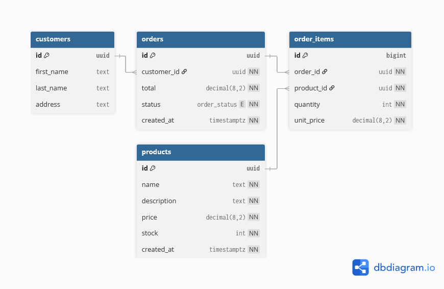
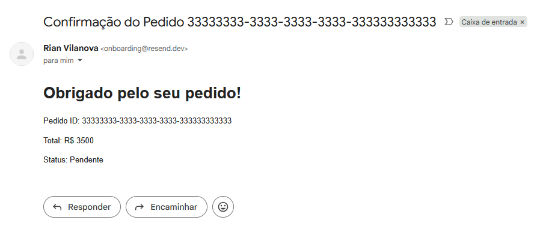

# Desafio Técnico Supabase - Backend de E-commerce

Este repositório contém a implementação de um backend completo para um sistema de e-commerce, desenvolvido como parte do desafio técnico para a posição de Desenvolvedor Júnior/Estagiário. O projeto foi construído utilizando as principais funcionalidades da plataforma Supabase, com foco em segurança, automação e boas práticas de desenvolvimento.

## Funcionalidades Implementadas

O projeto cumpre todos os requisitos principais solicitados no desafio:

  - [x] **Criação de Tabelas:** Estrutura de banco de dados relacional para gerenciar clientes, produtos e pedidos.
  - [x] **Segurança com RLS:** Implementação de políticas de Row-Level Security para garantir que os usuários acessem apenas seus próprios dados.
  - [x] **Automação com Funções de BD:** Criação de uma funções de banco de dados para o cálculo do total dos pedidos e alguns mais.
  - [x] **Consultas Eficientes com Views:** Desenvolvimento de  `VIEWs` para unificar e simplificar o acesso aos detalhes dos pedidos, otimizando as consultas das Edge Functions e permitindo consultas relevantes.
  - [x] **Edge Functions para Automação:**
      - [x] Uma função para o envio de e-mail de confirmação de pedido.
      - [x] Uma função para a exportação dos dados de um pedido em formato CSV.

## Decisões de Arquitetura

Durante o desenvolvimento, foram tomadas decisões importantes para garantir a qualidade, segurança e manutenibilidade do projeto:

  * **Segurança e Autenticação com Supabase Auth:** Optei por utilizar o sistema de autenticação nativo do Supabase em vez de criar uma simulação. Essa abordagem garante um nível de segurança muito maior, aproveitando os mecanismos de JWT da plataforma, e foi fundamental para a implementação robusta das políticas de RLS baseadas no `auth.uid()` de cada usuário.

  * **Isolamento de Dados com Row-Level Security (RLS):** As políticas de RLS foram aplicadas às tabelas `customers`, `orders` e `order_items`, que contêm dados sensíveis e pertencentes a usuários específicos. A tabela `products`, por sua vez, foi deixada pública para leitura, simulando o comportamento real de um catálogo de e-commerce e demonstrando um entendimento seletivo da aplicação de regras de segurança.

  * **Fluxo de Desenvolvimento com Supabase CLI:** Todas as funcionalidades serverless (Edge Functions) foram desenvolvidas e testadas localmente utilizando a Supabase CLI. Essa decisão permitiu um ciclo de desenvolvimento mais ágil e seguro, com a capacidade de depurar o código antes do deploy, além de facilitar a integração com o Git para versionamento.

  * **Performance e Desacoplamento com Views:** Em vez de fazer com que as Edge Functions realizassem `JOINs` complexos em múltiplas tabelas, foi criada a `view_order_details`. Essa `VIEW` serve como uma camada de abstração que desacopla a lógica de negócio da estrutura física do banco. Isso não apenas simplifica e limpa o código das Edge Functions, mas também melhora a performance ao centralizar a lógica da consulta no banco de dados.

## Estrutura do Banco de Dados

Abaixo está o diagrama que representa a estrutura do banco de dados do projeto.



## Tecnologias Utilizadas

  * Supabase (PostgreSQL, Auth, Edge Functions)
  * Deno (TypeScript)
  * Resend API (para envio de e-mails)
  * Postman (para testes de API)

## Como Executar o Projeto Localmente

1.  **Clone o Repositório:**
    ```bash
    git clone https://github.com/rianvilanova/EcommerceBackend
    cd EcommerceBackend
    ```
2.  **Inicie o Ambiente Supabase:**
    Este comando irá iniciar os contêineres Docker e aplicar as migrações do banco de dados automaticamente.
    ```bash
    supabase start
    ```
3.  **Popule o Banco de Dados.**

## Como Testar as Edge Functions

As funções foram desenvolvidas para serem testadas com um cliente de API como o Postman.

### 1\. Envio de E-mail de Confirmação

  * **Método:** `POST`
  * **URL:** `http://127.0.0.1:54321/functions/v1/send-confirmation-email`
  * **Headers:**
      * `Content-Type`: `application/json`
      * `Authorization`: `Bearer <sua_chave_anon_local>`
  * **Body:**
    ```json
    {
      "order_id": "ID_DE_UM_PEDIDO_EXISTENTE"
    }
    ```
  * **Observação:** *Como um domínio de e-mail não foi verificado, a função está configurada para usar o endereço de testes `onboarding@resend.dev`. Em um cenário de produção, bastaria alterar o campo `from` no código para um e-mail de domínio verificado.*

  Abaixo está um screenshot do e-mail de confirmação sendo recebido com sucesso após a execução da função.

  

### 2\. Exportação de Pedido para CSV

  * **Método:** `POST`
  * **URL:** `http://127.0.0.1:54321/functions/v1/export-order-csv`
  * **Headers e Body:** (Idênticos ao do envio de e-mail)
  * **Resposta Esperada:** O corpo da resposta será o texto puro do arquivo CSV.
